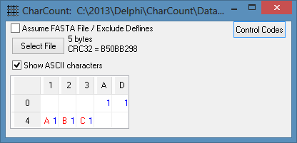
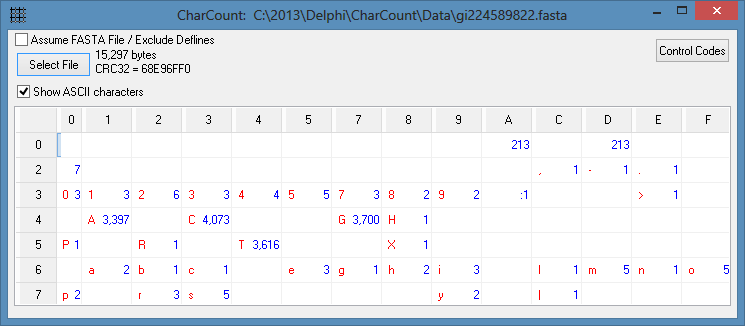
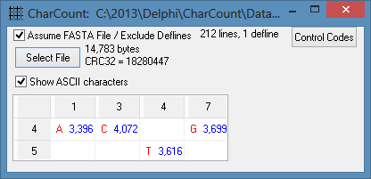

## CharCount utility

**CharCount** is a Windows utility to read text or binary files to produce frequency counts of all characters in the file.

This summary often shows unexpected characters in files, especially with very large files.

The summary shows the counts for each hex character x'00' through x'FF' in the file, but suppresses rows or columns that are zero.

The **CharCount** result for a binary file will often show the full 16-by-16 matrix.

Example 1
---------
An ASCII text file with the letters "ABC" also has a line-feed (x'0A') and carriage return (x'0C') at the end of each line.  If created in Linux, the file only has a line-feed (x'0A') at the end of the line.

The process the file, press the *Select File* button and select the file, or using Windows Explorer, simply drag and drop the file on the middle of the program.

Example 2
---------
An ASCII text file with a DNA sequence in FASTA format might look like this, with many characters appearing in the file.  The file has 213 lines and was likely created in a Windows environment since the number of x'0A' and x'0D' characters are the same.

Example 3
---------
The FASTA file in Example 2 consists of a "Defline" as the first line, followed by 212 rows of DNA sequences that consist of only As, Cs, Gs and Ts.  To ignore the defline and only count the sequence nucleotides, check the *Assume FASTA File* box before processing the file.

Run **CharCount** with a binary file (like an .exe, .jpg, or .png) to see almost all possibly characters, x'00' through x'FF', in a file.

